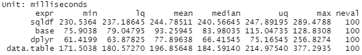
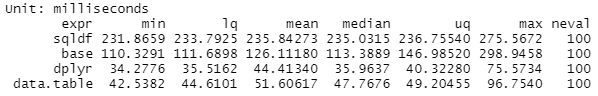
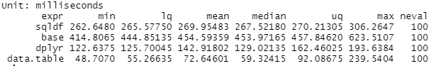

```{r setup, include=FALSE}
knitr::opts_chunk$set(echo = TRUE)
```

## Wstęp

Niniejszy dokument przedstawia zwęzły opis funkcji realizowanych przy użyciu języka R na przedmiocie Przetwarzanie danych w językach R i Python. W rozwiązaniach zostaną wykorzystane następujące dane:

* https://www.gagolewski.com/resources/data/travel_stackexchange_com/Posts.csv.gz
* https://www.gagolewski.com/resources/data/travel_stackexchange_com/Users.csv.gz
* https://www.gagolewski.com/resources/data/travel_stackexchange_com/Votes.csv.gz

## Funkcje

Na początku trzeba wprowadzić dane do środowiska oraz zaimportować niezbędne biblioteki, aby funkcje mogły z nich korzystać:

```
library(sqldf)
library(dplyr)
library(data.table)

Votes <- read.csv("Votes.csv")
Posts <- read.csv("Posts.csv")
Users <- read.csv("Users.csv")
```

Każde zapytanie jest realizowane na 4 sposoby:

- Funkcja "sqldf".
- Funkcje bazowe w R.
- Biblioteka "dplyr".
- Biblioteka .data.table".

Następnie zostanie podana krótka własna interpretacja każdego zapytania, wymagane testy czasowe oraz wynikająca z nich analiza:

1. Z tabeli "Posts" malejąco pobierają się posty okreslonego typu z największą ilością głosów z tabeli "Votes".

```
Zad1_1 <- function(){
  return (sqldf::sqldf(
    "SELECT UpVotesTab.*, Posts.Title FROM
(
SELECT PostId, COUNT(*) AS UpVotes
FROM Votes
WHERE VoteTypeId=2
GROUP BY PostId
) AS UpVotesTab
JOIN Posts ON UpVotesTab.PostId=Posts.Id
WHERE Posts.PostTypeId=1
ORDER BY UpVotesTab.UpVotes DESC
LIMIT 10
")
    )
}

Zad1_2 <- function(){
  VotesWithId2 <- Votes[Votes$VoteTypeId==2,] 
  upVotesTab <- aggregate(VotesWithId2[,'PostId'],by = list(PostId = VotesWithId2$PostId),FUN = length)
  names(upVotesTab)[2] <- 'UpVotes'
  resUpVotesTabNames <- names(upVotesTab)
  
  upVotesTab <- merge(upVotesTab,Posts[Posts$PostTypeId==1,],by.x="PostId", by.y ="Id")
  upVotesTab <- upVotesTab[order(-upVotesTab$UpVotes),]
  res <- head(subset(upVotesTab,select = c(resUpVotesTabNames,"Title")),10)
  row.names(res) <- NULL
  return (res)
}

Zad1_3 <- function(){
  
  upVotesTab <- filter(Votes, VoteTypeId==2)
  upVotesTab <- group_by(upVotesTab,PostId)
  upVotesTab <- summarise(upVotesTab,UpVotes = length(PostId))
  
  upVotesTab <- inner_join(upVotesTab,Posts[Posts$PostTypeId==1,],by = c("PostId" = "Id"))
  upVotesTab <- select(upVotesTab,PostId,UpVotes,Title)
  res <- as.data.frame(head(arrange(upVotesTab,desc(upVotesTab$UpVotes)),10))
  row.names(res) <- NULL
  return (res)
}

Zad1_4 <- function(){
  upVotesTab <- as.data.table(Votes)[VoteTypeId==2,.(UpVotes = .N), by = .(PostId)]
  upVotesTab <- upVotesTab[as.data.table(Posts)[PostTypeId==1,.(Id,Title),],on=.(PostId=Id)][order(-UpVotes)][1:10]
  return (as.data.frame(upVotesTab))
}
```

```
microbenchmark::microbenchmark(
  sqldf = Zad1_1(),
  base = Zad1_2(),
  dplyr = Zad1_3(),
  data.table = Zad1_4()
)
```


2. Pobierane są użytkownicy z tabeli "Users" które mają największe średnie oceny postów z tabeli "Posts". Pobierane tylko dziesięć pierwszych malejąco względem średniej oceny postów.

```
#Zadanie 2.1
Zad2_1 <- function(){
  return (sqldf::sqldf(
    "SELECT Users.DisplayName, Users.Age, Users.Location,
AVG(Posts.Score) as PostsMeanScore,
MAX(Posts.CreationDate) AS LastPostCreationDate
FROM Posts
JOIN Users ON Users.AccountId=Posts.OwnerUserId
WHERE OwnerUserId != -1
GROUP BY OwnerUserId
ORDER BY PostsMeanScore DESC
LIMIT 10
"
    )
  )
}

#Zadanie 2.2
Zad2_2 <- function(){
  PostsUsers <- merge(Posts[Posts$OwnerUserId != -1,],Users,by.x="OwnerUserId", by.y ="AccountId")
  df1 <- aggregate(Score~OwnerUserId,PostsUsers,mean)
  colnames(df1)[2] <- "PostsMeanScore"
  df2 <- aggregate(CreationDate.x~OwnerUserId,PostsUsers,max)
  colnames(df2)[2] <- "LastPostCreationDate"
  mergedData <- merge(merge(df1,df2),PostsUsers)
  uniqueMergedData <- unique(subset(mergedData,select = c("DisplayName","Age","Location","PostsMeanScore", "LastPostCreationDate")))
  res <- head(uniqueMergedData[order(-uniqueMergedData$PostsMeanScore),],10)
  row.names(res) <- NULL
  return (res)
}

#Zadanie 2.3

Zad2_3 <- function(){
  PostsUsers <- inner_join(Posts[Posts$OwnerUserId != -1,],Users,by = c("OwnerUserId" = "AccountId"))
  PostsUsers <- group_by(PostsUsers,OwnerUserId,DisplayName,Age,Location)
  PostsUsers <- summarise(PostsUsers,PostsMeanScore = mean(Score),LastPostCreationDate = max(CreationDate.x))
  PostsUsers <- subset(PostsUsers,select=c("DisplayName","Age","Location","PostsMeanScore","LastPostCreationDate"))
  res <- as.data.frame(head(arrange(PostsUsers,desc(PostsUsers$PostsMeanScore)),10))
  row.names(res) <- NULL
  return (res)
  
}

#Zadanie 2.4
Zad2_4 <- function(){
  return (as.data.frame(unique(as.data.table(Posts)[as.data.table(Users),
    on = .(OwnerUserId=AccountId)][OwnerUserId!=-1,.(DisplayName,Age,Location,PostsMeanScore = mean(Score),LastPostCreationDate = max(CreationDate)),
    by = .(OwnerUserId)])[,.(DisplayName,Age,Location,PostsMeanScore,LastPostCreationDate)][order(-PostsMeanScore)][1:10]))
}  
```
```
microbenchmark::microbenchmark(
  sqldf = Zad2_1(),
  base = Zad2_2(),
  dplyr = Zad2_3(),
  data.table = Zad2_4()
)
```




3. Wyszukiwane są użytkownicy, którzy mają większą ilość postów jako odpowiedzi niż postów jako zapytań. Wyświetlane malejąco względem postów jako zapytań.

```
#Zadanie 3.1
Zad3_1 <- function(){
  return (sqldf::sqldf(
    "SELECT DisplayName, QuestionsNumber, AnswersNumber
FROM
(
SELECT COUNT(*) as AnswersNumber, Users.DisplayName, Users.Id
FROM Users JOIN Posts ON Users.Id = Posts.OwnerUserId
WHERE Posts.PostTypeId = 1
GROUP BY Users.Id
) AS Tab1
JOIN
(
SELECT COUNT(*) as QuestionsNumber, Users.Id
FROM Users JOIN Posts ON Users.Id = Posts.OwnerUserId
WHERE Posts.PostTypeId = 2
GROUP BY Users.Id
) AS Tab2
ON Tab1.Id = Tab2.Id
WHERE QuestionsNumber < AnswersNumber
ORDER BY AnswersNumber DESC"
  ))
}


#Zadanie 3.2
Zad3_2 <- function(){
  UsersPosts <- merge(Users, Posts[Posts$PostTypeId == 1,],by.x ="Id",by.y="OwnerUserId")
  
  Tab1 <- aggregate(UsersPosts[,'Id'],by = list(Id = UsersPosts$Id),FUN = length)
  colnames(Tab1)[2] <- "AnswersNumber"
  Tab1 <- subset(merge(UsersPosts,Tab1), select = c("AnswersNumber","DisplayName","Id"))
  
  UsersPosts <- merge(Users, Posts[Posts$PostTypeId == 2,],by.x ="Id",by.y="OwnerUserId")
  Tab2 <- aggregate(UsersPosts[,'Id'],by = list(Id = UsersPosts$Id),FUN = length)
  colnames(Tab2)[2] <- "QuestionsNumber"
  Tab2 <- subset(merge(UsersPosts,Tab2), select = c("QuestionsNumber","Id"))
  
  res <- unique(merge(Tab1,Tab2))
  res <- res[res$QuestionsNumber < res$AnswersNumber,]
  res <- res[order(-res$AnswersNumber),]
  res <- subset(res,select = c("DisplayName","QuestionsNumber","AnswersNumber"))
  row.names(res) <- NULL
  
  return (res)
}


#Zadanie 3.3
Zad3_3 <- function(){
  UsersPosts <- inner_join(Users,Posts[Posts$PostTypeId == 1,],by = c("Id" = "OwnerUserId"))
  
  Tab1 <- group_by(UsersPosts,Id,DisplayName)
  Tab1 <- summarise(Tab1,AnswersNumber = length(Id))
  
  UsersPosts <- inner_join(Users,Posts[Posts$PostTypeId == 2,],by = c("Id" = "OwnerUserId"))
  
  Tab2 <- group_by(UsersPosts,Id)
  Tab2 <- summarise(Tab2,QuestionsNumber = length(Id))
  
  res <- inner_join(Tab1,Tab2, by="Id")
  res <- filter(res,QuestionsNumber < AnswersNumber)
  res <- subset(res,select = c("DisplayName", "QuestionsNumber", "AnswersNumber"))
  return (as.data.frame(arrange(res,desc(res$AnswersNumber))))
}


# Zadanie 3.4
Zad3_4 <- function(){
  Tab1 <- unique(as.data.table(Users)[as.data.table(Posts)[PostTypeId == 1],on = .(Id=OwnerUserId)][,.(AnswersNumber = length(DisplayName),DisplayName,Id),by = .(Id)])
  Tab2 <- unique(as.data.table(Users)[as.data.table(Posts)[PostTypeId == 2],on = .(Id=OwnerUserId)][,.(QuestionsNumber = length(DisplayName),DisplayName,Id),by = .(Id)])
  
  return (as.data.frame(unique(Tab1[Tab2,on=.(Id=Id),nomatch=0])[QuestionsNumber < AnswersNumber,.(DisplayName,QuestionsNumber,AnswersNumber)][order(-AnswersNumber)]))
}
```

```
microbenchmark::microbenchmark(
  sqldf = Zad3_1(),
  base = Zad3_2(),
  dplyr = Zad3_3(),
  data.table = Zad3_4()
)
```


4. Wyszykiwane są użytkownicy posiadające największą sumę polubień na postach jako pytań wraz z postem, który ma największą ilość polubień. Wybierane są 10 użytkowników z największą sumą polubień malejąco.

```
#Zadanie 4.1
Zad4_1 <- function(){
  return (sqldf::sqldf(
    "SELECT
Users.DisplayName,
Users.Age,
Users.Location,
SUM(Posts.FavoriteCount) AS FavoriteTotal,
Posts.Title AS MostFavoriteQuestion,
MAX(Posts.FavoriteCount) AS MostFavoriteQuestionLikes
FROM Posts
JOIN Users ON Users.Id=Posts.OwnerUserId
WHERE Posts.PostTypeId=1
GROUP BY OwnerUserId
ORDER BY FavoriteTotal DESC
LIMIT 10
"
  ))
}


#Zadanie 4.2
Zad4_2 <- function(){
  PostsUsers <- merge(Posts[Posts$PostTypeId == 1,],Users,by.x="OwnerUserId", by.y ="Id")
  PostsUsers <- PostsUsers[!is.na(PostsUsers$FavoriteCount),]
  df1 <- aggregate(FavoriteCount~OwnerUserId,PostsUsers,sum)
  colnames(df1)[2] <- "FavoriteTotal"
  
  df2 <- aggregate(FavoriteCount~OwnerUserId,PostsUsers,max)
  colnames(df2)[2] <- "MostFavoriteQuestionLikes"
  
  res <- merge(merge(df1,df2),PostsUsers)
  colnames(res)[which(colnames(res)=="Title")] <- "MostFavoriteQuestion"
  res <- res[res$FavoriteCount == res$MostFavoriteQuestionLikes,]
  res <- unique(subset(res,select = c("DisplayName","Age","Location","FavoriteTotal","MostFavoriteQuestion","MostFavoriteQuestionLikes")))
  res <- head(res[order(-res$FavoriteTotal),],10)
  row.names(res) <- NULL
  return (res)
}


#Zadanie 4.3
Zad4_3 <- function(){
  PostsUsers <- inner_join(Posts[Posts$PostTypeId == 1,],Users,by = c("OwnerUserId" = "Id"))
  PostsUsers <- filter(PostsUsers,!is.na(PostsUsers$FavoriteCount))
  
  res <- group_by(PostsUsers,OwnerUserId)
  res <- summarise(res, FavoriteTotal = sum(FavoriteCount), MostFavoriteQuestionLikes = max(FavoriteCount))
  res <- inner_join(res,PostsUsers,by = c("OwnerUserId" = "OwnerUserId"))
  res <- filter(res,FavoriteCount == MostFavoriteQuestionLikes)
  res <- rename(res,MostFavoriteQuestion = Title)
  res <- subset(res,select = c("DisplayName","Age","Location","FavoriteTotal","MostFavoriteQuestion","MostFavoriteQuestionLikes"))
  res <- as.data.frame(head(arrange(res,desc(res$FavoriteTotal)),10))
  row.names(res) <- NULL
  return (res)
}


#Zadanie 4.4
Zad4_4 <- function(){
  return (as.data.frame(as.data.table(Posts)[PostTypeId==1][as.data.table(Users),
    on=.(OwnerUserId=Id)][!is.na(FavoriteCount),.(DisplayName,Age,Location,FavoriteTotal = sum(FavoriteCount),MostFavoriteQuestionLikes = max(FavoriteCount),FavoriteCount,Title),
    by = .(OwnerUserId)][FavoriteCount == MostFavoriteQuestionLikes][,.(DisplayName,Age,Location,FavoriteTotal,MostFavoriteQuestion = Title,MostFavoriteQuestionLikes)][order(-FavoriteTotal)][1:10]))
  
}
```

```
microbenchmark::microbenchmark(
  sqldf = Zad4_1(),
  base = Zad4_2(),
  dplyr = Zad4_3(),
  data.table = Zad4_4()
)
```




5. Pobierane zostają 10 pierwszych postów mających największą różnicę pomiędzy maksymalną ilością polubień, którą ma właściciel posta, a oceną tego posta malejąco.


```
#Zadanie 5.1
Zad5_1 <- function(){
  return (sqldf::sqldf(
    "SELECT
Questions.Id,
Questions.Title,
BestAnswers.MaxScore,
Posts.Score AS AcceptedScore,
BestAnswers.MaxScore-Posts.Score AS Difference
FROM (
SELECT Id, ParentId, MAX(Score) AS MaxScore
FROM Posts
WHERE PostTypeId==2
GROUP BY ParentId
) AS BestAnswers
JOIN (
SELECT * FROM Posts
WHERE PostTypeId==1
) AS Questions
ON Questions.Id=BestAnswers.ParentId
JOIN Posts ON Questions.AcceptedAnswerId=Posts.Id
ORDER BY Difference DESC
LIMIT 10
"
  ))
}


#Zadanie 5.2
Zad5_2 <- function(){
  BestAnswers <- Posts[Posts$PostTypeId == 2,]
  df1 <- aggregate(Score~ParentId,BestAnswers,max)
  colnames(df1)[2] <- "MaxScore"
  
  BestAnswers <- merge(df1,BestAnswers, by.x = "ParentId",by.y = "ParentId")
  BestAnswers <- BestAnswers[BestAnswers$MaxScore == BestAnswers$Score,]
  BestAnswers <- subset(BestAnswers,select = c("Id","ParentId","MaxScore"))
  
  Questions <- Posts[Posts$PostTypeId == 1,]
  PostsQuestions <- merge(BestAnswers,Questions,by.x = "ParentId",by.y = "Id")
  res <- merge(
    subset(PostsQuestions,select = c("AcceptedAnswerId","MaxScore","Title")),
    subset(Posts,select = c("Id","Score")),
    by.x = "AcceptedAnswerId",by.y = "Id")
  res <- merge(res,Posts[,c("Id","AcceptedAnswerId")],by.x = "AcceptedAnswerId",by.y = "AcceptedAnswerId")
  
  Difference <- res[,c("MaxScore")] - res[,c("Score")]
  
  res <- cbind(res,Difference)
  colnames(res)[which(colnames(res)=="Score")] <- "AcceptedScore"
  
  
  
  res <- subset(res, select = c("Id","Title","MaxScore","AcceptedScore","Difference"))
  res <- head(res[order(-res$Difference),],10)
  row.names(res) <- NULL
  return (res)
}

# Zadanie 5.3
Zad5_3 <- function(){
  FilteredPosts <- Posts[Posts$PostTypeId == 2,]
  BestAnswers <- group_by(FilteredPosts,ParentId)
  BestAnswers <- summarise(BestAnswers,MaxScore = max(Score))
  BestAnswers <- inner_join(BestAnswers,FilteredPosts,by = c("ParentId" = "ParentId"))
  
  Questions <- Posts[Posts$PostTypeId == 1,]
  
  res <- inner_join(select(BestAnswers,Id,ParentId,MaxScore),Questions,by = c("ParentId" = "Id"))
  res <- select(res,AcceptedAnswerId,MaxScore,Title)
  res <- unique(inner_join(res,Posts[,c("Id","Score")],by = c("AcceptedAnswerId" = "Id")))
  res <- inner_join(res,Posts[,c("Id","AcceptedAnswerId")], by = c("AcceptedAnswerId" = "AcceptedAnswerId"))
  Difference <- res[,c("MaxScore")] - res[,c("Score")]
  Difference <- rename(Difference,Difference = MaxScore)
  res <- rename(res,AcceptedScore = Score)
  res <- bind_cols(res, Difference)
  res <- subset(res, select = c("Id","Title","MaxScore","AcceptedScore","Difference"))
  return (as.data.frame(head(res[order(-res$Difference),],10)))
}

#Zadanie 5.4
Zad5_4 <- function(){
  BestAnswers <- as.data.table(Posts)[PostTypeId==2,.(Id = head(Id,1),MaxScore = max(Score)),by=.(ParentId)]
  Questions <- as.data.table(Posts)[PostTypeId==1]
  return (as.data.frame(BestAnswers[Questions,on=.(ParentId=Id)]
                [as.data.table(Posts),on=.(AcceptedAnswerId=Id)][,.(Id = ParentId,Title,MaxScore,AcceptedScore = i.Score,Difference = MaxScore - i.Score)][order(-Difference)][1:10]))
}
```

```
microbenchmark::microbenchmark(
  sqldf = Zad5_1(),
  base = Zad5_2(),
  dplyr = Zad5_3(),
  data.table = Zad5_4()
)
```



## Sprawdzanie poprawności zapytań

Rownoważność zapytań została testowana za pomocą komendy all.equal w następujący sposób:

```
all.equal(Zad1_1(), Zad1_2(), ignore.col.order = TRUE)
all.equal(Zad1_1(), Zad1_3(), ignore.col.order = TRUE)
all.equal(Zad1_1(), Zad1_4(), ignore.col.order = TRUE)

all.equal(Zad2_1(), Zad2_2(), ignore.col.order = TRUE)
all.equal(Zad2_1(), Zad2_3(), ignore.col.order = TRUE)
all.equal(Zad2_1(), Zad2_4(), ignore.col.order = TRUE)

all.equal(Zad3_1(), Zad3_2(), ignore.col.order = TRUE)
all.equal(Zad3_1(), Zad3_3(), ignore.col.order = TRUE)
all.equal(Zad3_1(), Zad3_4(), ignore.col.order = TRUE)

all.equal(Zad4_1(), Zad4_2(), ignore.col.order = TRUE)
all.equal(Zad4_1(), Zad4_3(), ignore.col.order = TRUE)
all.equal(Zad4_1(), Zad4_4(), ignore.col.order = TRUE)

all.equal(Zad5_1(), Zad5_2(), ignore.col.order = TRUE)
all.equal(Zad5_1(), Zad5_3(), ignore.col.order = TRUE)
all.equal(Zad5_1(), Zad5_4(), ignore.col.order = TRUE)
```

Dla wygodności dodany jest argument do ignorowania porządku kolumn, ale każde z zapytań robi to w dobrym pożądku. Wynik wygląda następująco:


Nie udało mi się dopracować zapytanie 3.4 ponieważ nie znalazłem różnicy w odpowiedzi referencyjnej, a swoją. Pozostałe testy przeszły pomyślnie. 

## Ocena czasu wykonania

Z implementacji funkcji oraz pomiarów czasowych, wykonanych wcześniej można wyciągnąć następujące wnioski:
1. Rozwiązanie referencyjne za pomocą zapytania SQL daje nie średnie wyniki, ale jest dosyć wygodna przy czytaniu 
2. Za pomocą funkcji bazowych najtrudniej implementować rozwiązania oraz otrzymywać dobre wyniki czasowe
3. Przy wykorzystywaniu biblioteki dplyr w większości zapytań dostałem najlepsze wyniki czasowe oraz dosyć czytelny kod
4. Data.table jest bardzo mocnym i wygodnym narzędziem przy pisaniu zapytań, ale w moich rozwiązaniach moim zdaniem nie dałem rady realizować wszystkie możliwości wydajnościowe. 

Po napisaniu wszystkich zapytań doszłem do wniosku, że najwygodniej dla mnie korzystająć z biblioteki dplyr, dlatego że daje ona bardzo dobre wyniki czasowe i czytanie kodu jest bardzo przejrzyste.


